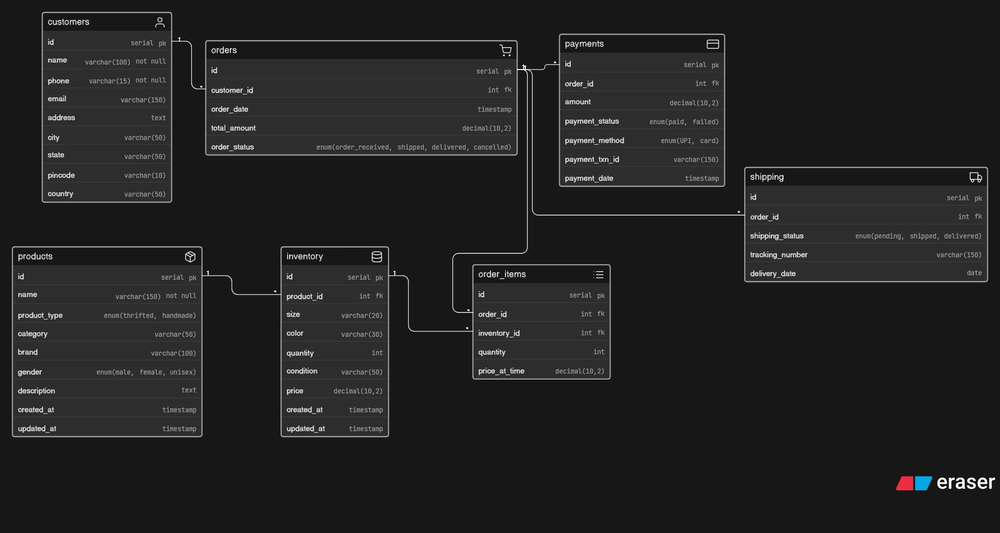

# 📚 5-Day Database Design Series

This repository contains my journey of learning and designing real-world database systems.

Each day focuses on solving a practical problem using proper ER modeling and normalized database design.

## 🚀 Goals

* Improve database design skills
* Think in real-world scenarios
* Build scalable and clean schemasa

## 📊 ER Diagram

# Day 1 → Instagram Thrift Store DB Design ✅

# Day 2 → Fitness Influencer Coaching Platform 

* Day 3 → Coming Soon...
* Day 4 → Coming Soon...
* Day 5 → Coming Soon...

## 🛠 Tools Used

* Eraser.io
* PostgreSQL-style schema

---

Follow along as I build and learn in public 🚀
