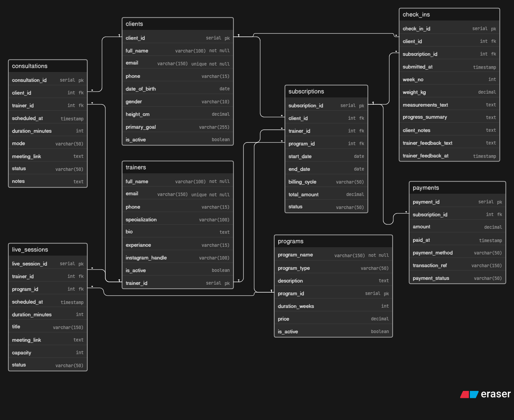

# 📦 Day 2: Fitness Influencer Coaching Platform Database Design

## 🧠 Problem

A fitness influencer wants to sell his/her coaching programs online. They need a system to manage clients, subscriptions, live sessions, consultations, and track client progress.

The goal is to design a clean database that can handle:

* Multiple trainers & clients
* Subscription plans with recurring payments
* Live group sessions + 1:1 consultations
* Weekly progress tracking

## 🔥 Key Challenges

* One client can have multiple subscriptions (different trainers/programs)
* One subscription needs multiple payments (recurring)
* Weekly check-ins with trainer feedback
* Need to track both group live sessions and private consultations

## 💡 Solution

* Created a strong `subscriptions` table as the central junction
* Used separate tables for `consultations` and `live_sessions`
* `check_ins` table for weekly progress with trainer feedback
* Payments kept separate to support recurring billing

## 🧱 Entities

* Trainers
* Clients
* Programs
* Subscriptions
* Consultations
* Live Sessions
* Check-ins
* Payments

## 📊 ER Diagram

## 🚀 Learning

This helped me understand:

* Designing subscription-based systems
* Handling recurring payments properly
* Structuring progress tracking & feedback
* Managing 1-to-Many and Many-to-Many relationships in real scenarios

---

Day 2 complete ✅