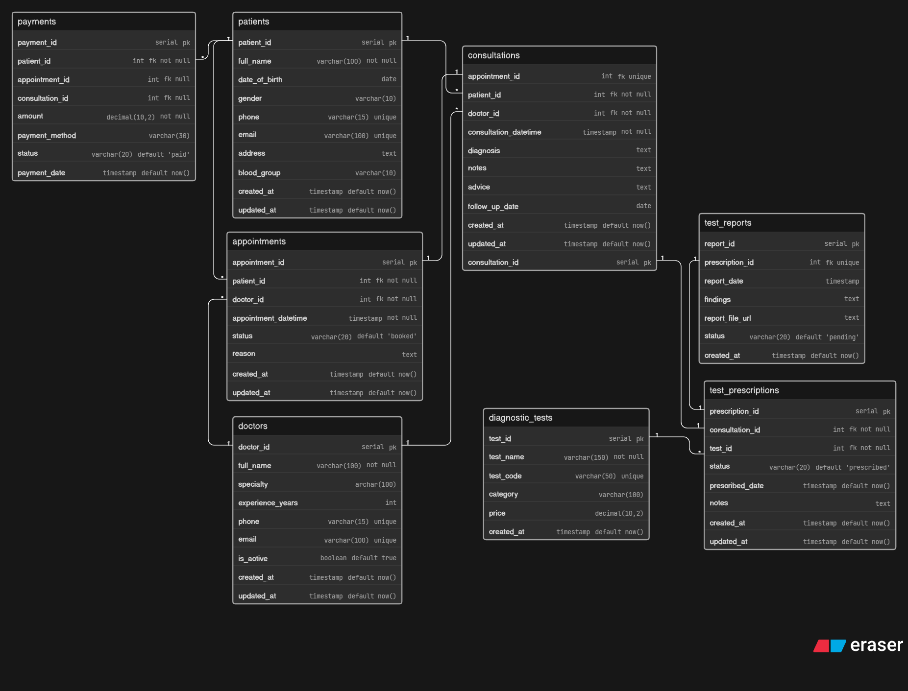

# 📦 Day 3: Clinic Appointment & Diagnostics Platform Database Design

## 🧠 Problem

A modern clinic wants to digitize its operations. The system should manage doctors, patients, appointments, consultations, diagnostic tests, reports, and payments.

The goal is to design a clean and scalable database that can handle:

* Multiple doctors across different specialties
* Patients visiting multiple times
* Appointment booking and actual consultations
* Diagnostic test prescriptions and report generation
* Flexible payment handling

---

## 🔥 Key Challenges

* Difference between **appointment (booking)** and **consultation (actual visit)**
* Not every appointment results in a consultation
* One consultation can have multiple diagnostic tests
* Reports are generated later and must be linked correctly
* Supporting walk-in patients (without appointment)
* Handling flexible payments (appointment or consultation based)

---

## 💡 Solution

* Separated **appointments** and **consultations** for real-world accuracy
* Introduced a **junction table (`test_prescriptions`)** for handling multiple tests
* Linked **reports to prescriptions** to maintain proper traceability
* Created a **specialties table** to normalize doctor specialization
* Designed **flexible payments** with optional links to appointments or consultations

---

## 🧱 Entities

* Patients
* Doctors
* Specialties
* Appointments
* Consultations
* Diagnostic Tests
* Test Prescriptions
* Test Reports
* Payments

---

## 📊 ER Diagram

---

## 🚀 Learning

This project helped me understand:

* Real-world healthcare database design
* Difference between booking systems and actual service execution
* Handling **Many-to-Many relationships** using junction tables
* Designing systems where data is generated **asynchronously (reports)**
* Structuring flexible and scalable payment systems

---

## 🧠 Key Design Decisions

* Appointment ≠ Consultation (critical separation)
* Tests are linked to consultations, not appointments
* Reports are linked to test prescriptions (not directly to patient)
* Specialty is normalized into a separate table
* Payments support multiple real-world scenarios

---

## 🚀 Future Improvements

* Add prescriptions (medicines)
* Doctor availability & scheduling system
* Lab technician module
* Notification system (SMS/Email)
* Audit logs for reports and payments

---

Day 3 complete ✅
