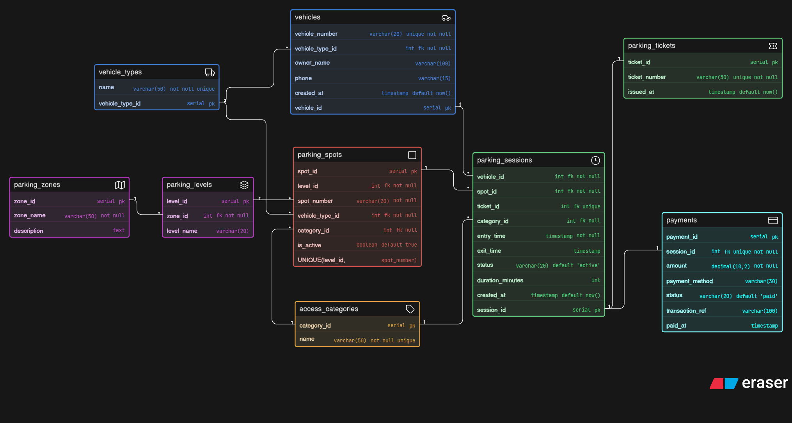

# 📦 Day 4: Comic-Con Parking System Database Design

## 🧠 Problem

A large convention venue hosts Comic-Con India, where thousands of visitors arrive with different types of vehicles across multiple days.

The system needs to manage vehicle entry, parking allocation, reserved categories, sessions, tickets, and payments across multiple zones and levels.

---

## 🔥 Key Challenges

* Handling **multi-zone and multi-level parking structure**
* Supporting different **vehicle types (bike, car, SUV, EV, cab)**
* Managing **reserved parking categories (VIP, Staff, Exhibitors, EV)**
* Tracking **entry and exit timestamps properly**
* Ensuring **one spot can be reused across multiple sessions**
* Designing a system that can track **currently parked vehicles**

---

## 💡 Solution

* Introduced **parking_sessions as the core entity** for entry-exit tracking
* Separated **zones → levels → spots** for scalable structure
* Used **vehicle_types** for proper normalization and compatibility
* Added **access_categories** for reserved parking handling
* Linked **tickets and payments with sessions** for clean flow

---

## 🧱 Entities

* Vehicle Types
* Vehicles
* Access Categories
* Parking Zones
* Parking Levels
* Parking Spots
* Parking Sessions
* Parking Tickets
* Payments

---

## 📊 ER Diagram

---

## 🚀 Learning

This project helped me understand:

* Designing **real-world parking systems at scale**
* Handling **resource allocation (parking spots)** dynamically
* Modeling **time-based systems (entry/exit sessions)**
* Structuring **hierarchical relationships (zone → level → spot)**
* Managing **one-to-many reuse scenarios (spot reuse over time)**

---

## 🧠 Key Design Decisions

* Parking session is the **core entity** (tracks entry & exit)
* One vehicle can have **multiple sessions across days**
* One parking spot can be **reused multiple times**
* Reserved parking handled using **access categories**
* Vehicle compatibility enforced using **vehicle types**
* Tickets and payments are **linked 1:1 with sessions**

---

## 🚀 Future Improvements

* Dynamic pricing based on duration or peak hours
* Real-time parking availability dashboard
* EV charging slot tracking with usage logs
* QR-based smart entry/exit system
* Admin panel for monitoring parking usage

---

Day 4 complete ✅
