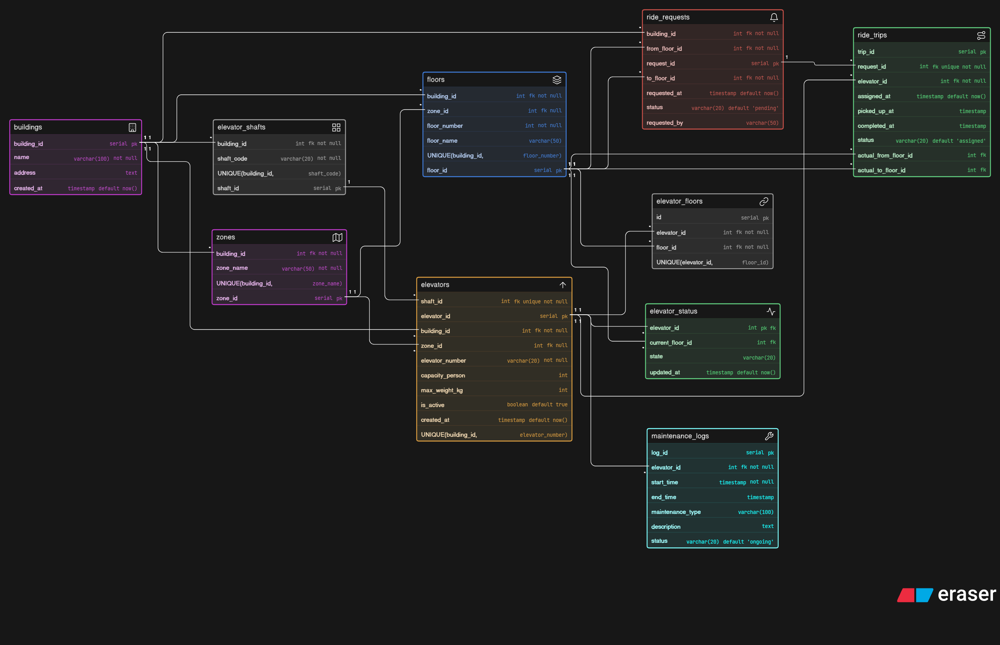

# 📦 Day 5: Smart Elevator Control System Database Design

## 🧠 Problem

LiftGrid Systems builds intelligent elevator control platforms for large buildings like malls, airports, hospitals, and corporate towers.

The system must manage multiple buildings, elevators, floor requests, ride allocation, status tracking, and maintenance logs efficiently.

---

## 🔥 Key Challenges

* Supporting **multiple buildings and elevators**
* Handling **floor-level ride requests**
* Mapping **elevators to multiple floors (M:N)**
* Tracking **real-time elevator status**
* Managing **maintenance without losing history**
* Recording **ride logs for analytics**

---

## 💡 Solution

* Introduced **ride_requests and ride_trips separation** for clarity
* Used **elevator_floors mapping** to handle many-to-many relationships
* Created **elevator_status table** for real-time tracking
* Added **maintenance_logs** to track service history
* Structured the system for scalability across multiple buildings

---

## 🧱 Entities

* Buildings
* Floors
* Elevator Shafts
* Elevators
* Elevator-Floor Mapping
* Ride Requests
* Ride Trips
* Elevator Status
* Maintenance Logs

---

## 📊 ER Diagram

---

## 🚀 Learning

This project helped me understand:

* Designing **large-scale infrastructure systems**
* Handling **real-time and historical data separately**
* Managing **Many-to-Many relationships effectively**
* Structuring systems for **high-frequency event tracking**
* Building scalable backend architectures

---

## 🧠 Key Design Decisions

* Ride Request = user intent
* Ride Trip = actual execution
* Elevator status stored separately for real-time updates
* Maintenance logs preserve historical data
* Elevators mapped to floors using junction table
* One request maps to one trip

---

## 🚀 Future Improvements

* Smart elevator allocation algorithm (AI-based)
* Peak-hour optimization
* Real-time dashboard for monitoring
* Alert system for maintenance issues
* Integration with IoT sensors

---

Day 5 complete ✅
